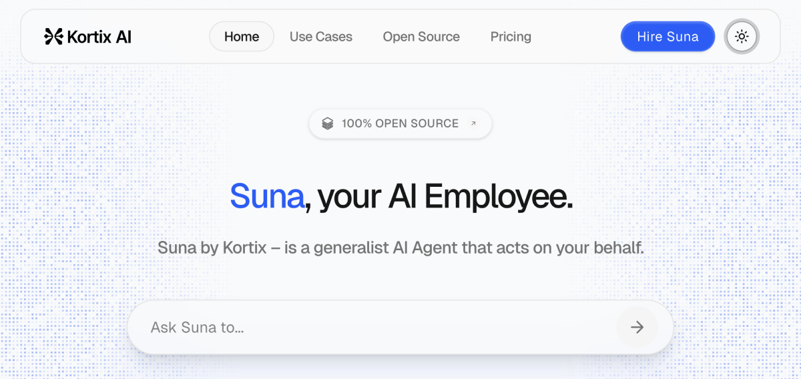

<div align="center">

# Novah - Open Source Generalist AI Agent

(that acts on your behalf)

 <!-- TODO: Update banner.png to a Novah banner -->

Novah is a fully open source AI assistant that helps you accomplish real-world tasks with ease. Through natural conversation, Novah becomes your digital companion for research, data analysis, and everyday challenges—combining powerful capabilities with an intuitive interface that understands what you need and delivers results.

Novah's powerful toolkit includes seamless browser automation to navigate the web and extract data (using DuckDuckGo and Requests+BeautifulSoup), file management for document creation and editing, command-line execution for system tasks, and integration with Google Gemini for its core LLM capabilities. These capabilities work together harmoniously, allowing Novah to solve your complex problems and automate workflows through simple conversations!

[](./license)
[](https://discord.gg/Py6pCBUUPw) <!-- TODO: Update Discord link if necessary -->
[](https://x.com/novah_ai) <!-- TODO: Update Twitter handle -->
[](https://github.com/novah-ai/novah) <!-- TODO: Update GitHub repo link -->
[](https://github.com/novah-ai/novah/labels/bug) <!-- TODO: Update GitHub repo link -->

</div>

## Table of Contents

- [Novah Architecture](#project-architecture)
  - [Backend API](#backend-api)
  - [Frontend](#frontend)
  - [Agent Docker](#agent-docker)
  - [Database](#database)
  - [Task Queue](#task-queue)
- [Use Cases](#use-cases)
- [Self-Hosting](#self-hosting)
- [Acknowledgements](#acknowledgements)
- [License](#license)

## Project Architecture

<!-- TODO: Update Architecture Diagram (docs/images/diagram.png) to reflect new architecture -->
 

*Note: The diagram above is outdated and needs to be updated to reflect the current Novah architecture.*

Novah consists of several main components:

### Backend API

Python/FastAPI service that handles REST endpoints, thread management, and LLM integration with Google Gemini.

### Frontend

Next.js/React application providing a responsive UI with chat interface, dashboard, etc. Authentication is currently mocked.

### Agent Docker

Isolated execution environment for every agent, managed by the Docker SDK. It includes browser automation, code interpreter, file system access, and tool integration.

### Database

SQLite is used for data persistence, including user management (mocked), conversation history, agent state, etc. Data is stored in a Docker volume.

### Task Queue
RabbitMQ is used for managing background tasks for the agent.

## Use Cases

(Use cases remain broadly similar, but underlying tools have changed. URLs to examples might be outdated.)

1. **Competitor Analysis** - _"Analyze the market for my next company in the healthcare industry, located in the UK. Give me the major players, their market size, strengths, and weaknesses, and add their website URLs. Once done, generate a PDF report."_
2. **VC List** - _"Give me the list of the most important VC Funds in the United States based on Assets Under Management. Give me website URLs, and if possible an email to reach them out."_
3. **Looking for Candidates** - _"Go on LinkedIn, and find me 10 profiles available - they are not working right now - for a junior software engineer position, who are located in Munich, Germany. They should have at least one bachelor's degree in Computer Science or anything related to it, and 1-year of experience in any field/role."_
... (other use cases can be briefly listed if still relevant)

## Self-Hosting

Novah can be self-hosted on your own infrastructure using Docker Compose. For a comprehensive guide to self-hosting Novah, please refer to our [Self-Hosting Guide](./docs/SELF-HOSTING.md).

The setup process includes:

- Configuring environment variables (e.g., `GEMINI_API_KEY`, `SQLITE_DB_PATH`).
- Running `docker-compose up` to start the backend, frontend, worker, and RabbitMQ services.
- SQLite database will be stored in a Docker volume (`db_data`).

### Prerequisites
* Docker and Docker Compose
* Python (for running any local setup scripts, though not strictly required if only using Docker)
* Node.js (for frontend development or custom builds)
* A Google Gemini API Key

### Quick Start

1. **Clone the repository**:
   ```bash
   git clone https://github.com/novah-ai/novah.git # TODO: Update with correct repo URL
   cd novah
   ```

2. **Configure Environment Variables**:
   Copy `backend/.env.example` to `backend/.env` and `frontend/.env.example` to `frontend/.env.local`.
   Fill in the required values, especially:
   - `backend/.env`:
     - `GEMINI_API_KEY`: Your Google Gemini API Key.
     - `SQLITE_DB_PATH=/app/db/agentpress.db` (default, path inside Docker container)
     - Other variables as needed (e.g., `RABBITMQ_HOST`).
   - `frontend/.env.local`:
     - `NEXT_PUBLIC_BACKEND_URL=http://localhost:8000` (if running backend locally via Docker Compose)

3. **Run with Docker Compose**:
   ```bash
   docker-compose up --build
   ```
   This will build the images and start all services. The backend will be available at `http://localhost:8000` and the frontend at `http://localhost:3000`.

4. **(Optional) Run Setup Wizard (if updated)**:
   If a `setup.py` script is provided and updated for the new architecture, run it:
   ```bash
   python setup.py 
   ```
   *Note: The original `setup.py` and `start.py` scripts may need significant updates to work with the new Docker-based architecture and removal of Daytona/Supabase.*

### Manual Setup

See the [Self-Hosting Guide](./docs/SELF-HOSTING.md) for detailed manual setup instructions.

## Contributing

We welcome contributions from the community! Please see our [Contributing Guide](./CONTRIBUTING.md) for more details.

## Acknowledgements

### Main Contributors 
(List of contributors can be updated as appropriate)
- [Adam Cohen Hillel](https://x.com/adamcohenhillel)
- [Dat-lequoc](https://x.com/datlqqq)
- [Marko Kraemer](https://twitter.com/markokraemer)


### Technologies
Major technologies used in Novah:
- [Python](https://www.python.org/) & [FastAPI](https://fastapi.tiangolo.com/) - Backend framework
- [Next.js](https://nextjs.org/) & [React](https://react.dev/) - Frontend framework
- [Docker](https://www.docker.com/) - Containerization and Sandbox execution
- [SQLite](https://www.sqlite.org/) - Database
- [RabbitMQ](https://www.rabbitmq.com/) - Task queue
- [Google Gemini](https://deepmind.google/technologies/gemini/) - LLM provider
- [DuckDuckGo Search](https://duckduckgo.com/) (via library) - Web search
- [Requests](https://requests.readthedocs.io/) & [BeautifulSoup](https://www.crummy.com/software/BeautifulSoup/) - Web scraping
- [Playwright](https://playwright.dev/) - Browser automation (still used within sandbox)

## License

Novah (formerly Suna) is licensed under the Apache License, Version 2.0. See [LICENSE](./LICENSE) for the full license text.
